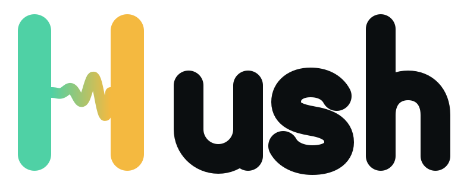
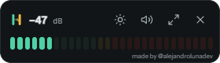
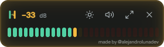
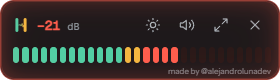
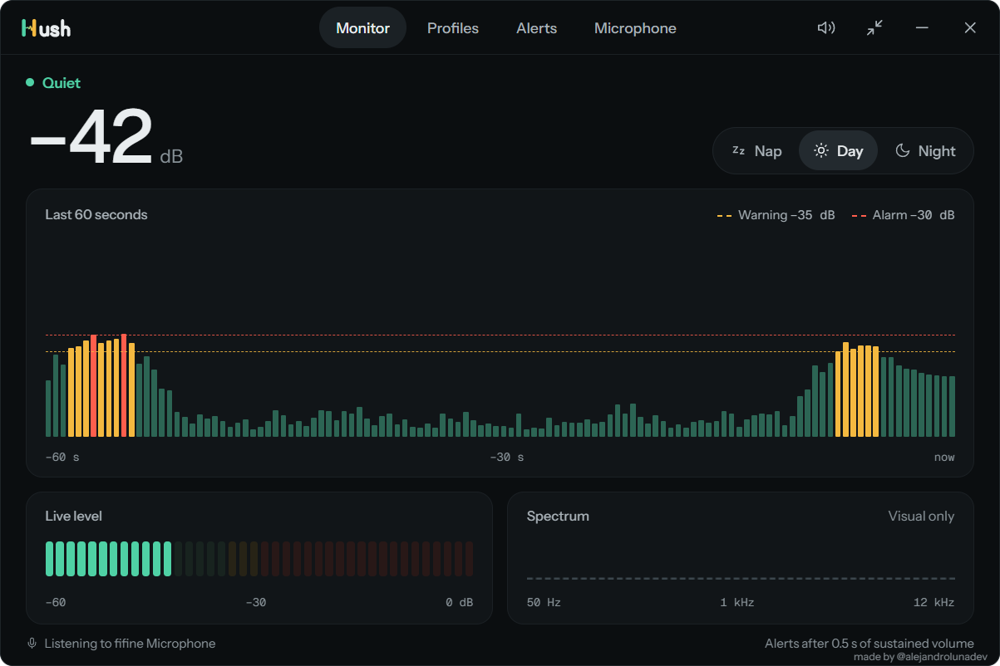
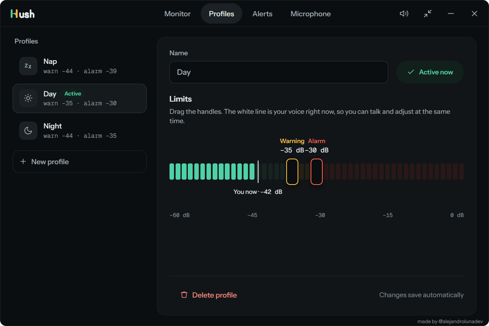
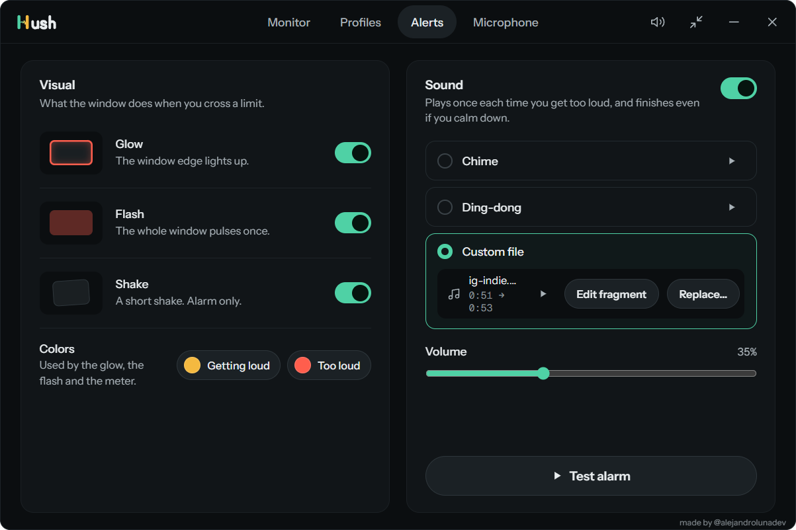
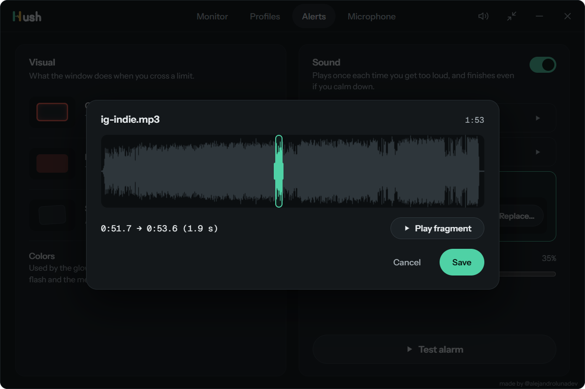

  <picture>
    <source media="(prefers-color-scheme: dark)" srcset="assets/hush-wordmark-dark-bg.svg">
    
  </picture>

  <strong>Get a nudge before your voice fills the house.</strong> 
  A tiny desktop app that listens to your microphone and warns you, with light and sound, when you start talking louder than you want to.

  <a href="https://github.com/AlejandroLunaDev/hush-app/releases/latest"><strong>⬇ Download for Windows</strong></a>
  ·
  <a href="https://github.com/AlejandroLunaDev/hush-app/releases/latest">macOS (beta)</a>

  
  
  

---

## What it does

You're on a call at night, the kids are asleep, and your voice creeps up without you noticing. Hush sits in a small always-on-top widget and tracks how loud you are. When you stay above your limit for half a second, it lights up the window, can shake it, and plays a sound, so you notice before anyone else does.

- **Two limits.** A gentle *Getting loud* warning and a *Too loud* alarm.
- **Profiles.** Switch between *Nap*, *Day* and *Night*, or create your own with its own icon and limits.
- **No false alarms.** Claps and key hits are ignored. Only sustained speech counts.
- **Your alerts, your way.** Glow, flash and shake, each with its own toggle. Pick the warning and alarm colors.
- **Your own alarm sound.** Use the built-in *Chime* or *Ding-dong*, or load any MP3, WAV or OGG and choose the exact 1–10 s fragment that plays.
- **Mute in one click.** Keep the light and the shake, silence the sound.
- **Stays up to date.** Hush tells you when a new version is out and updates with one click, after checking the installer's checksum.
- **Private by design.** Audio is analyzed on your computer and never recorded or sent anywhere.

## Screenshots

  

<em>Monitor: your level right now, the last 60 seconds, and your active profile.</em>

  

<em>Profiles: drag the limits while you talk and see where your voice lands.</em>

  

<em>Alerts: glow, flash, shake, colors and the alarm sound.</em>

  

<em>Pick the exact fragment of your song that plays as the alarm.</em>

## Install

### Windows 10 / 11

1. Download `Hush_0.10.0_x64-setup.exe` from the [latest release](https://github.com/AlejandroLunaDev/hush-app/releases/latest).
2. Run it. Windows may show **"Windows protected your PC"**. That's because the app isn't code-signed yet, not because something is wrong. Click **More info → Run anyway**.
3. The first time Hush opens, pick your microphone, set your limits, and it starts listening.

If Windows blocks the microphone, open **Settings › Privacy & security › Microphone** and turn on **Let desktop apps access your microphone**. Hush has a button that takes you there.

### macOS (beta)

1. Download `Hush_0.10.0_universal.dmg` from the [latest release](https://github.com/AlejandroLunaDev/hush-app/releases/latest). It runs on Apple Silicon and Intel Macs.
2. Open the `.dmg` and drag **Hush** to **Applications**.
3. The app isn't notarized by Apple yet, so the first time, **right-click Hush → Open → Open**. If macOS still refuses, go to **System Settings › Privacy & Security** and click **Open Anyway**.
4. Allow microphone access when macOS asks.

The macOS build hasn't been tested on real Mac hardware yet. Expect rough edges, and please [report anything odd](https://github.com/AlejandroLunaDev/hush-app/issues).

## Status

**0.10.0 is a public beta.** Everything works, but it has had little real-world use so far. Found a bug or have an idea? [Open an issue](https://github.com/AlejandroLunaDev/hush-app/issues).

The source code is private. This repository hosts the downloads and release notes.

---

Made by <a href="https://github.com/AlejandroLunaDev">@alejandrolunadev</a>

